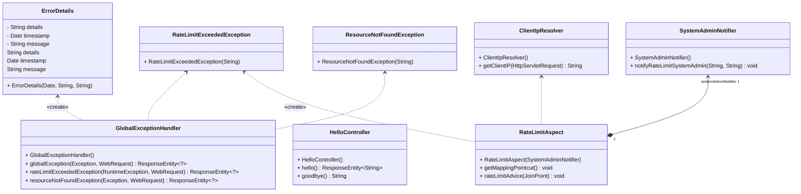

# Rate Limit Aspect

Bu Java sınıfı, `@GetMapping` anotasyonu ile işaretlenmiş herhangi bir methoda gelen istekleri izleyerek, belirli bir limit aşıldığında bu istekleri reddeder. İstemci IP adreslerini ve blok sürelerini saklamak için bir harita kullanır. Ayrıca her bir istemci IP adresi ve her bir endpoint için gelen istek sayılarını tutmak için ayrı bir harita kullanır. Böylelikle bir dakikada izin verilen maksimum istek sayısını ve istekler arasındaki süre sınırını (60 saniye) kontrol edebilir.

Bu sınıf ayrıca istemcinin başlangıçta bloklanma süresini (ilk olarak 20 saniye) ve maksimum bloklama süresini (600 saniye) belirler. Bu süreleri aşan durumlarda sistem yöneticisine belirli koşullar altında bilgilendirme mesajları gönderebilir.

Kullanım açısından, `@GetMapping` anotasyonu ile işaretlenmiş metodları izlemek için AspectJ ile bir nokta kesimi tanımlar ve bu nokta kesimi çalıştığında belirli işlemleri gerçekleştirmek üzere ön tanımlı bir metod (`rateLimitAdvice`) ile bu nokta kesimi çalıştığında gerçekleştirilecek işlemleri belirler.

Her bir HTTP isteğinde istemci IP adresini alır ve bu istemcinin daha önce bloklandıysa durumunu kontrol eder. Ardından istek sayısını ve süre sınırlarını kontrol ederek istek limiti aşıldığında isteği reddeder. Ayrıca bu durumda sistem yöneticisine bilgilendirme mesajı gönderir ve istemciyi belirli bir süre için bloklar.

Bu işlevleri gerçekleştirebilmek için sınıf içerisinde aşağıdaki değişkenleri kullanır:
- `clientBlockTimeMap`: İstemci IP adreslerini ve blok sürelerini saklamak için bir ConcurrentHashMap.
- `blockCountMap`: IP adreslerinin bloklama sayısını tutmak için bir ConcurrentHashMap.
- `requestCountMap`: İstemci IP adreslerinin ve her endpoint için istek sayılarını tutmak için bir ConcurrentHashMap.
- `REQUEST_LIMIT`: Bir dakikada izin verilen maksimum istek sayısı.
- `TIME_LIMIT`: İstekler arasındaki süre sınırı (60 saniye).
- `INITIAL_BLOCK_TIME`: İstemcinin bloklandığı başlangıç süresi (ilk olarak 20 saniye).
- `MAX_BLOCK_TIME`: Maksimum bloklama süresi (600 saniye).
- `SystemAdminNotifier`: Sistem yöneticisine bilgilendirme mesajları göndermek için kullanılan bir yardımcı sınıf.

Bu sınıf, uygulamaların güvenliğini artırmak ve istemcilerin hizmet kalitesini korumak amacıyla oldukça faydalı bir araçtır. Özellikle yoğun trafik alan uygulamalarda istemcilerin aşırı kullanımını engellemek için etkili bir çözüm sunmaktadır.

---

